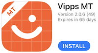

# Vipps Developers

This repository contains various resources for Vipps developers, including:

* [Getting started](vipps-getting-started.md) with the Vipps Developer Portal and API requests
* [How to contribute](contribute.md) to Vipps projects on GitHub
* [How to contact us](contact.md) in the Vipps Integration team

## Table of contents

- [Postman](#postman)
- [Example code](#example-code)
- [The Vipps test environment (MT)](#the-vipps-test-environment-mt)
    + [Test users](#test-users)
- [Vipps test apps](#vipps-test-apps)
  * [iOS](#ios)
  * [Android](#android)
- [Vipps design guidelines](#vipps-design-guidelines)
- [Vipps repositories on GitHub](#vipps-repositories-on-github)
  * [Pull all GitHub repositories in the current directory](#pull-all-github-repositories-in-the-current-directory)
- [Additional developer resources](#additional-developer-resources)

# Postman

[Postman](https://www.getpostman.com/) is a common tool for working with REST APIs.
We offer [Postman Collections](https://www.getpostman.com/collection) for some APIs.
Postman can import Swagger files directly, so collections is not a requirement.

With Postman you can make calls to all the API endpoints and see the full
request and response for each call, including headers.

When contacting us about API issues, we are usually able to help faster if you send us
the complete request and response.

See our [Postman guide](https://github.com/vippsas/vipps-developers/blob/master/postman-manual.md) or the
 [Postman documentation](https://www.getpostman.com/docs/) for more information about using Postman.

## Our Postman collections and environments

| Product           | Github Link |
|:------------------|:------------
| eCommerce V2      | [https://github.com/vippsas/vipps-ecom-api/tree/master/tools](https://github.com/vippsas/vipps-ecom-api/tree/master/tools)            |
| Invoice           | [https://github.com/vippsas/vipps-invoice-api/tree/master/tools](https://github.com/vippsas/vipps-invoice-api/tree/master/tools)      |
| Recurring         | [https://github.com/vippsas/vipps-recurring-api/tree/master/tools](https://github.com/vippsas/vipps-recurring-api/tree/master/tools)  |


# Example code

We have made some example code available, in hope that it may be useful:
https://github.com/vippsas/vipps-developers/tree/master/code-examples

# The Vipps test environment (MT)

The Merchant Test Environment (MT) is available for all Vipps customers.

The environment is suitable for testing _most_ of the Vipps functionality, but some
functionality in the production environment is not available in MT.
In general, MT does not contain functionality that requires integration with
third parties, such as Payment Service Providers, EVRY, Nets, banks, etc.

Functionality not available in MT (a non-exhaustive list):
* Push alerts may be unstable
* Payment of invoices, both for Vipps Regninger and Vipps Faktura
* Limited support for testing card statuses that require connections to Nets, etc
* Limited support for looking up customer information in [KAR](https://www.bits.no/en/bank/konto-og-adresseringsregister-kar/), etc

To test functionality that is not available in MT, you will have to use the
production environment in a controlled manner. One example may be to test
Vipps Regninger with real invoices, but with small amounts. We recommend 2 NOK.

Other differences in MT:
* We allow 10,000 incorrect PIN attempts before locking the Vipps user's account

### Test users

The welcome email contains information about your test user, which has the following dummy data:

* Name
* Phone number
* PIN
* Bank account number
* Credit card number

You can use this test user to in the [Vipps test apps](#vipps-test-apps).

If you need additional payment cards, you can add it in the Vipps app.
See [Credit card numbers](https://github.com/vippsas/vipps-developers/tree/master/testdata#credit-card-numbers)
for more details.

See also: [Vipps Test Data](https://github.com/vippsas/vipps-developers/blob/master/testdata/README.md).

# Vipps test apps

The test apps are identical to the production app, but connects to the
Vipps [the Vipps test environment (MT)](#the-vipps-test-environment-mt) instead of the production environment.

## iOS



The iOS test app is available in Apple TestFlight: https://testflight.apple.com/join/hTAYrwea
You do *not* need an activation code.

1. Open the [TestFlight](https://testflight.apple.com/join/hTAYrwea) link
2. Install the "Vipps MT" app
3. Open the "Vipps MT" app
4. Log in with the test phone number, that was sent in the welcome email to the email address used in the registration. Your normal Vipps user is not available in the test environment.
5. On the "Verify your number" screen: Use PIN  `1236`.
6. On the "Enter your code" screen: Use PIN `1236`.
7. Enable FaceID (or TouchID) and confirm with PIN  `1236`.
8. Accept push notifications.

You are now ready to use the iOS test app connected to the Vipps test environment.

**Important:** Do _not_ use the test phone number in production, as the test number may be a real phone number for a Vipps user.

## Android

The Android test app is available at: https://install.appcenter.ms/orgs/vipps/apps/vipps-android/distribution_groups/mt%20testers
You do *not* need an activation code.

Please log into the test app with your test user, that was sent in the welcome email to the email address
used in the registration (your normal Vipps user is not available in the test environment).
You do *not* need an activation code.

# Vipps design guidelines

Guidelines, logos, buttons, etc: https://github.com/vippsas/vipps-design-guidelines

# Vipps repositories on GitHub

To clone [all the Vipps repositories](https://github.com/vippsas), this works for macOS:

1. Install [Homebrew](https://brew.sh), the missing package manager for macOS  
        ```
/usr/bin/ruby -e "$(curl -fsSL https://raw.githubusercontent.com/Homebrew/install/master/install)"
        ```
2. Install [jq](https://stedolan.github.io/jq/), a lightweight and flexible command-line JSON processor  
        ```
brew install jq
       ```
3. Run this command  
        ```
curl -s https://api.github.com/orgs/vippsas/repos | jq .[].clone_url | xargs -n 1 git clone
        ```

## Pull all GitHub repositories in the current directory

Creating an alias like `gitall` for this command may be useful:

```
find . -type d -depth 1 -exec git --git-dir={}/.git --work-tree=$PWD/{} pull origin master \;
```

# Additional developer resources

* Developer overview: https://vipps.no/developer
* High-level overview of the APIs: http://vippsas.github.io
* Products, personal: http://vipps.no/privat
* Products, business: http://vipps.no/bedrift

**The Vipps Integration team**  
[Get in touch here](contact.md)
